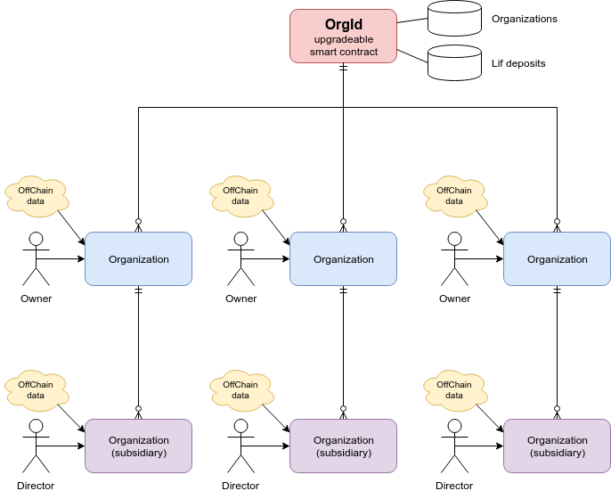

[](https://travis-ci.org/windingtree/org.id)
[](https://coveralls.io/github/windingtree/org.id?branch=master&v=2.0) 

# ORG.ID Smart Contract

Smart contract of the Winding Tree ORG.ID protocol

## Initial setup  

```bash
npm i
npm link
```

## Tests

```bash
npm run test
npm run test ./<path_to_test_file>.js
``` 

## Tests coverage  

```bash
npm run coverage
``` 

## Linting

```bash
npm run lint

```

## Generated docs
[OrgId](./docs/OrgId.md)

## Contracts ABI and addresses

Install the package

```bash
$ npm i @windingtree/org.id
```

Import ABIs in the your JavaScript code

```javascript
const { OrgIdContract, OrgIdInterfaceContract, addresses } = require('@windingtree/org.id');
```

Addresses of the deployed ORG.ID contract

```javascript
const { mainnet, ropsten, rinkeby } = addresses;
```

## ORG.ID Structure



OrgId smart contract manages information about organizations and their Lif token deposits. Each organization record inside the contract storage contains following information:

- **orgId**: The organization unique Id. A hash that represents a hex value of the bytes32 string. This identifier can be generated by the organization owner by his own or automatically generated on the smart contract side at the moment of organization record creation. 
- **orgJsonUri**: Offchain data. URI that points to the Organization JSON file available online. This file has to be created against the [ORG.ID JSON schema](https://github.com/windingtree/org.json-schema) rules.
- **orgJsonHash**: keccak256 hash of the ORG.ID JSON contents
- **parentEntity**: The parent organization Id
- **owner**: The organization owner
- **director**: The organization director. Only awailable for subsidiaries
- **state**: State of the organization (enabled or disabled)
- **directorConfirmed**: Flag is director ownership is confirmed. Director ownership confirmation os required for cases when director address is different from the parent organization owner address.
- **deposit**: Lif deposit value

Any organization registered at the OrgId smart contract can make a **deposit of Lif tokens**. Staking of this deposit is a part of a trust schema in the ORG.ID protocol. Deposits can be withdrawn but a certain delay is required between the withdraw request and real withdrawal. This delay is managed by the OrgId owner for now (community-managed in the future).

## Contract deployment

All deployments, upgrades, transactions, calls and complex tasks can be hadled using our [command line tools](./management/tools/README.md): 

```bash
$ orgid-tools --network ropsten cmd=deploy name=OrgId from=0xA0B74BFE28223c9e08d6DBFa74B5bf4Da763f959 initMethod=initialize initArgs=0xA0B74BFE28223c9e08d6DBFa74B5bf4Da763f959,0xB6e225194a1C892770c43D4B529841C99b3DA1d7
```

The result will look like:

```bash
Deployment of the contract:  OrgId
Version:  0.11.4
Owner address:  0xA0B74BFE28223c9e08d6DBFa74B5bf4Da763f959
Initializing method:  initialize
Initializing arguments:  [ '0xA0B74BFE28223c9e08d6DBFa74B5bf4Da763f959',
  '0xB6e225194a1C892770c43D4B529841C99b3DA1d7' ]
Contract deployed at address:  0xc8fD300bE7e4613bCa573ad820a6F1f0b915CfcA
```

Auto-generated deployment configuration will be saved on the `./openzeppelin` repository folder and will look like:

```json
{
  "version": "0.11.4",
  "contract": {
    "name": "OrgId",
    "implementation": "0xd863861E680B4C881A91fC92C36bAB1d09F8cd3A",
    "proxy": "0xc8fD300bE7e4613bCa573ad820a6F1f0b915CfcA"
  },
  "owner": "0xA0B74BFE28223c9e08d6DBFa74B5bf4Da763f959",
  "proxyAdmin": null,
  "blockNumber": 7455603
}
```

The filename of the configuration file is formed according to mask:   
`./<NETWORK_NAME>-<CONTRACT_NAME>.json`

## Contract upgrade

Upgrading of the contract is pretty similar to the deployment procedure but with a little difference. To be able to make an upgrade a configuration file (that had been created on the previous step) must already exist. So do not remove file with deployment information. In opposite case, the error message will be thrown and you will not be able to upgrade the contract. The second thing is a repository version. This version should be different from the previously deployed.

```bash
$ orgid-tools --network ropsten cmd=upgrade name=OrgId from=0xA0B74BFE28223c9e08d6DBFa74B5bf4Da763f959 initMethod=setInterfaces
```

The result will look like:

```bash
Upgrading of the contract:  OrgId
Version:  0.11.5
Owner address:  0xA0B74BFE28223c9e08d6DBFa74B5bf4Da763f959
Initializing method:  setInterfaces
COntract upgraded at address:  0xc8fD300bE7e4613bCa573ad820a6F1f0b915CfcA
