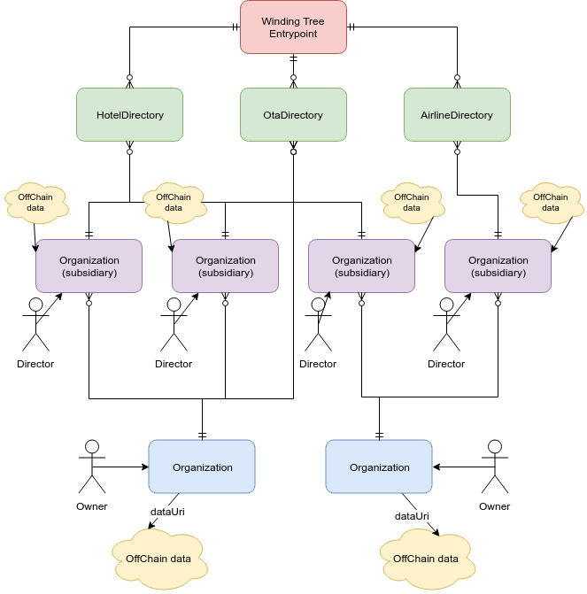

[](https://travis-ci.org/windingtree/wt-contracts)
[](https://coveralls.io/github/windingtree/wt-contracts?branch=master&v=2.0) [](https://greenkeeper.io/)

# WT Smart Contracts

Smart contracts of the Winding Tree platform.

## Documentation

  

Generated documentation is in the [`docs`](https://github.com/windingtree/wt-contracts/tree/master/docs)
folder and can be generated by running `npm run soldoc`.

There are two main groups of users in the Winding Tree platform - content producers (e. g. Hotels, Airlines)
and content consumers (e. g. OTAs (Online Travel Agencies)).

### Content producers

When a producer wants to participate, they have to do the following:

1. Locate Winding Tree Entrypoint address
1. Prepare off-chain data conforming to the [specification](https://github.com/windingtree/wt-organization-schemas). This specification is conformed with [Decentralized Identifiers (DIDs) standard](https://w3c.github.io/did-core/)
1. Create their organization smart contract (commonly referred to as 0xORG)
    1. Fully custom
        1. Create an implementation of `OrganizationInterface` smart contract.
        1. Deploy the custom implementation.
    1. Using forked version of the `Organization` smart contract
        1. Fork current repository and deploy your own Organization
        1. Use the URI of off-chain data and a keccak256 hash of its contents as initialization parameters
    1. As an Organization owner you can create subsidiaries organizations by calling `createSubsidiary` method 
2. Locate the appropriate Segment Directory address
3. Add their newly created organization of subsidiaries to the segment directory by calling the `add` method

### Content consumers

When a consumer wants to participate, they have to do the following:

1. Locate Winding Tree Entrypoint address
1. Locate the appropriate Segment Directory address
1. Call `getOrganizations` on the Segment Directory.
1. Call `getOrgJsonUri` on every non-zero address returned as an instance of `OrganizationInterface` and crawl the off-chain data
for more information.
1. Call `getOrgJsonHash` on every non-zero address returned as an instance of `OrganizationInterface` and verify that the current
off-chain data contents hash matches the hash published in the smart contract.

If a signed message occurs somewhere in the platform, a content consumer might want to decide
if it was signed by an account associated with the declared Organization. That's when they would
first verify the signature and obtain an address of the signer. In the next step, they have to verify
that the actual signer is registered as an `associatedKey` with the Organization by checking its smart contract.

### Working with content hashes

In order to reduce the attack surface, we require a hash of the off-chain stored data. We assume that it
will not change very frequently, so updating the hash every-so-often won't add a significant cost to the whole operation.
So, how does the hash actually look like? It is a `keccak256` (an Ethereum flavour of `sha3`) of the stringified ORG.JSON.
Let's try an example:

```js
const web3utils = require('web3-utils');
const stringOrgJsonContents = `{
    "@context": "https://windingtree.com/ns/did/v1",
    "id": "did:orgid:0xB4Caa470E33A4cE899C16e6C7E125eA03956e95D",
    "created": "2019-01-01T13:10:02.251Z",
    "updated": "2019-06-03T13:20:06.398Z",
    "publicKey": [...],
    "service": [...],
    "trust": {...},
    "legalEntity": {
        "legalName": "Acme, Corp.",
        "alternativeName": "Acme",
        "legalIdentifier": "US12345567",
        "identifiers": [
            {
                "type": "IATA",
                "value": "123456"
            },
            {...}
        ],
        "legalType": "GmBH",
        "registeredAddress": {...},
        "locations": [...],
        "contacts": [
            {
                "function": "Customer Service",
                "name": "John Smith",
                "phone": "+1234567890",
                "email": "email@spam.com"
            },
            {...}
        ]
    }
}`;
// It is important to work with a textual ORG.JSON and *not* a JSON-parsed and re-serialized form.
// JSON serializers might be producing different outcomes which would result in different hashes.
const hashedOrgJson = web3utils.soliditySha3(stringOrgJsonContents);
console.log(`Put me into 0xORG: ${hashedOrgJson}`);
```

You can also produce `keccak256` hashes in a myriad of other tools, such as
[this one](https://emn178.github.io/online-tools/keccak_256.html).

## Requirements

Node 10 is required for running the tests and contract compilation.

## Installation

```sh
npm install @windingtree/wt-contracts
```

```js
import Organization from '@windingtree/wt-contracts/build/contracts/Organization.json';
// or
import { OrganizationInterface, AbstractSegmentDirectory } from '@windingtree/wt-contracts';
```

## Development

```sh
git clone https://github.com/windingtree/wt-contracts
nvm install
npm install
npm test
```

You can run a specific test with `npm test -- test/segment-directory.js`
or you can generate a coverage report with `npm run coverage`.

Project configuration file is placed here: [.openzeppelin/project.json](.openzeppelin/project.json)  

### Flattener

A flattener script is also available. `npm run flattener` command
will create a flattened version without imports - one file per contract.
This is needed if you plan to use tools like [etherscan verifier](https://etherscan.io/verifyContract)
or [securify.ch](https://securify.ch/).

## Deployment

We are using the upgradeability proxy from [openzeppelin](https://docs.openzeppelin.com/sdk/2.5/)
and the deployment pipeline is using their system as well. You can read more
about the [publishing process](https://docs.openzeppelin.com/sdk/2.5/publish) and
[upgrading](https://docs.openzeppelin.com/sdk/2.5/api/upgrades) in `openzeppelin`
documentation.

If you want to deploy just an `Organization` or `SegmentDirectory` contract separately you will need to use our scripts that can be found in the [./management](./management) folder of this repository [TODO]

In order to interact with "real" networks such as `mainnet`, `ropsten` or others,
you need to setup a `keys.json` file used by [truffle](https://truffleframework.com/)
that does the heavy lifting for openzeppelin.

```json
{
  "mnemonic": "<SEED_PHRASE>",
  "infura_projectid": "<PROJECT_ID>"
}
```

### Upgradeability FAQ

**What does upgradeability mean?**

We can update the logic of Entrypoint, Segment Directory or Organization while keeping their
public address the same and **without touching any data**.

**Who is the proxy admin on mainnet?**
The proxies are administered by a 2/5 multisignature wallet, the ENS address is [proxyowner.windingtree.eth](https://etherscan.io/enslookup?q=proxyowner.windingtree.eth).

**Who is the owner wt contracts deployed on mainnet?**
The WindingTreeEntrypoint, OrganizationFactory and Segments are owned by a 3/5 multisignature wallet, the ENS address is [windingtree.eth](https://etherscan.io/enslookup?q=windingtree.eth).

**Can you change the Organization data structure?**

The Organization owner can, yes. As long as we adhere to
[openzeppelin recommendations](https://docs.openzeppelin.com/sdk/2.5/writing-contracts),
it should be safe. The same applies for Segment Directory and Entrypoint

**Can I switch to the new Organization version?**

If you deployed the (upgradeable) Organization yourself you can do it yourself. If you used a non-upgradeable smart contract implementation, then no.

**Why do I keep getting "revert Cannot call fallback function from the proxy admin" when interacting with Organization?**

This is a documented behaviour of [openzeppelin upgradeability](https://docs.openzeppelin.com/sdk/2.5/faq#why-are-my-getting-the-error-cannot-call-fallback-function-from-the-proxy-admin).
You need to call the proxied Organization contract from a different account than is the proxy owner.

**What happens when you upgrade a Segment Directory?**

The Directory address stays the same, the client software has to
interact with the Directory only with the updated ABI which is distributed
via NPM (under the new version number). No data is lost.

**How do I work with different organization versions on the client?**
That should be possible by using an ABI of `OrganizationInterface` on the client side.  

### Organizations hierarchy

Organizations can have subsidiaries. The subsidiary is like a regular organization but linked with a parent organization and can be managed by a special role - `entityDirector`. This director can use the following methods: `changeOrgJsonUri`, `changeOrgJsonHash`, `changeOrgJsonUriAndHash`, `addAssociatedKey`, `removeAssociatedKey` but cannot transfer organization ownership. Organization ownership transferring, enabling or disabling subsidiaries, changing of the subsidiary director are available only for a parent organization owner (via parent organization interface).  

For the creation of a new subsidiary owner of the organization (or its entity director) should use the following functions of `Organization` contract:
- `createSubsidiary` with parameters: `orgJsonUri` (string type), `orgJsonHash` (bytes32 type), `subsidiaryDirector` (address type). 
- `createSubsidiaryAndAddToDirectory` with parameters: `orgJsonUri` (string type), `orgJsonHash` (bytes32 type), `subsidiaryDirector` (address type), `directory` (address type). This function also will add a new subsidiary organization to the provided directory.  
As a result of the function execution, will be obtained an address of the subsidiary organization.   

The director of the subsidiary has to confirm his ownership using the function `confirmSubsidiaryDirectorOwnership` with parameter `subsidiaryAddress` (address type). Subsidiaries, where the director does not confirm his ownership rights, are not shown in the public list of subsidiaries that available via getter `getSubsisiaries`.  

For the change of the subsidiary status (enabled/disabled) owner of the parent organization can use the function:  
- `toggleSubsidiary` with parameter `subsidiaryAddress` (address type).  
Disabled subsidiaries are not shown in the public subsidiaries list available via getter `getSubsidiaries`.  

For getting the address of the parent organization can be used public getter `parentEntity`.   

For getting the account address of the director can be used public getter  `entityDirector`.  

For getting current information about the subsidiary can be used function `getSubsidiary` with parameter `subsidiaryAddress` (address type). This function will return the following options: `id` - subsidiary address (address type), `state` - subsidiary state (boolean type), `confirmed` - director ownership confirmation status, `director` - account address of the director.  

### Contracts deployment and upgrade process

- All contracts in this repository can be managed as separate upgradability projects (recommended). For these purposes, you can use `OpenZeppelin CLI` or our simplified tool `WindingRree CLI` that can be found in the folder `./management/tools`.  
- All initial contracts deployments are will be based on the version that pointed in the `package.json` file.  
- After an initial deployment project configuration file will be created in the folder `./openzeppelin` automatically. Name of this file should have the following format `[network_Type]-[Contract_Name].json` (e.g. `private-Contract.json`). The local development network type is named as `private`, all other networks will have its own regular names like `ropsten`, `rinkeby` or `mainnet`.  

> Here the example of the project configuration:  

```json
{
  "version": "0.9.0",
  "contract": {
    "name": "Organization",
    "implementation": "0x630589690929E9cdEFDeF0734717a9eF3Ec7Fcfe",
    "proxy": "0xDb56f2e9369E0D7bD191099125a3f6C370F8ed15"
  },
  "owner": "0x90f8bf6a479f320ead074411a4b0e7944ea8c9c1",
  "app": "0x0290FB167208Af455bB137780163b7B7a9a10C16",
  "proxyAdmin": "0x26b4AFb60d6C903165150C6F0AA14F8016bE4aec",
  "implementationDirectory": "0x67B5656d60a809915323Bf2C40A8bEF15A152e3e",
  "package": "0x9b1f7F645351AF3631a656421eD2e40f2802E6c0",
  "blockNumber": 18
}
```

- To instantiate new contract on the network you should run the following command:  

```bash
./management/tools/index.js --network development cmd=contract name=Organization from=0x90f8bf6a479f320ead074411a4b0e7944ea8c9c1 initArgs=0x90f8bf6a479f320ead074411a4b0e7944ea8c9c1,https://gist.githubusercontent.com/[username]/3bde88a0e8248c73c68c1aed2ca4b9be/raw/c3b4ebfe4af22832fb468393032a416b2482e99a/ORG.ID,0x1fe120cfd8f0cf216189a07e1a25b7da38030986b849b79ed59c0036456561dd,[APP],[PROXY_ADMIN],0x0000000000000000000000000000000000000000,0x0000000000000000000000000000000000000000
```
> Command parameters explanation:  
> - `--network development`: network from the `truffle.js` configuration file. Required
> - `cmd-contract`: command type. This type is allowing making new deployments or upgrades. Type is required
> - `from=0x90f8bf6a479f320ead074411a4b0e7944ea8c9c1`: transaction sender address. Required
> - `initArgs=[ARG_1],[ARG_2],[ARG_3]`: initial deployment initializer arguments. Optional. initial deployment initializer arguments. Optional. Arguments can have, also templates like `[APP]` and `[PROXY_ADMIN]`. These templates will be replaced with their actual values during the deployment (or upgrade).

The result of this command execution should looks like:  

```
================================================================================ 
WindingTree Command Line Interface  
Version:  0.9.0                // <-- tool version
Contract name:  Organization   // <-- Contract name
Actual version:  0.9.0         // <-- Current repository version
Last known version:  0.9.0     // <-- Previouisly deployed version
App address:  0xe78A0F7E598Cc8b0Bb87894B0F60dD2a88d6a8Ab
Proxy admin:  0xD833215cBcc3f914bD1C9ece3EE7BF8B14f841bb
Contract implementation:  0x9561C133DD8580860B6b7E504bC5Aa500f0f06a7
================================================================================ 
New deployment  
Contract proxy:  0x59d3631c86BbE35EF041872d502F218A39FBa150

```

- Contract upgrade  

> CLI tool will detect upgrade need automatically from the difference of previous and current version number.

```bash
./management/tools/index.js --network development cmd=contract name=Organization from=0x90f8bf6a479f320ead074411a4b0e7944ea8c9c1 upgradeProxies=0x7e664541678C4997aD9dBDb9978C6E2B5A9445bE,0x9561C133DD8580860B6b7E504bC5Aa500f0f06a7
```

> `upgradeProxies=[PROXY_ADDRESS],[PROXY_ADDRESS][...]`: optional parameter. If you want to upgrade your subsidiary organizations then using `upgradeProxies` parameter you should list their address

> If your upgraded contract requiring running of its own initialization method then you can define it using parameter `upgradeMethod` and its arguments can be listed as `upgradeArgs`  

## Local testing 

You need to run `npm run dev-net` and you will have an output of your addresses and private keys ready to use like this:

```
Available Accounts
==================
(0) 0x90f8bf6a479f320ead074411a4b0e7944ea8c9c1 (~100 ETH)
(1) 0xffcf8fdee72ac11b5c542428b35eef5769c409f0 (~100 ETH)
(2) 0x22d491bde2303f2f43325b2108d26f1eaba1e32b (~100 ETH)
(3) 0xe11ba2b4d45eaed5996cd0823791e0c93114882d (~100 ETH)
(4) 0xd03ea8624c8c5987235048901fb614fdca89b117 (~100 ETH)
(5) 0x95ced938f7991cd0dfcb48f0a06a40fa1af46ebc (~100 ETH)
(6) 0x3e5e9111ae8eb78fe1cc3bb8915d5d461f3ef9a9 (~100 ETH)
(7) 0x28a8746e75304c0780e011bed21c72cd78cd535e (~100 ETH)
(8) 0xaca94ef8bd5ffee41947b4585a84bda5a3d3da6e (~100 ETH)
(9) 0x1df62f291b2e969fb0849d99d9ce41e2f137006e (~100 ETH)
```

> You can instantiate your own local `ganache-cli` configuration. We will use accounts shown above just for example purposes, you will need to use your owns.  

- Deployment of the `WindingTreeEntrypoint`

```bash
./management/tools/index.js --network development cmd=contract name=WindingTreeEntrypoint from=0x90f8bf6a479f320ead074411a4b0e7944ea8c9c1 initArgs=0x90f8bf6a479f320ead074411a4b0e7944ea8c9c1,0x0000000000000000000000000000000000000000
```

Results with:

```
================================================================================ 
WindingTree Command Line Interface  
Version:  0.9.0
Contract name:  WindingTreeEntrypoint
Actual version:  0.9.0
Last known version:  0.9.0
App address:  0xe78A0F7E598Cc8b0Bb87894B0F60dD2a88d6a8Ab
Proxy admin:  0xD833215cBcc3f914bD1C9ece3EE7BF8B14f841bb
Contract implementation:  0x9561C133DD8580860B6b7E504bC5Aa500f0f06a7
================================================================================ 
New deployment  
Contract proxy:  0x59d3631c86BbE35EF041872d502F218A39FBa150
```

- Deployment of the `SegmentDirectory`

```bash
./management/tools/index.js --network development cmd=contract name=SegmentDirectory from=0x90f8bf6a479f320ead074411a4b0e7944ea8c9c1 initArgs=0x90f8bf6a479f320ead074411a4b0e7944ea8c9c1,hotels,0x0000000000000000000000000000000000000000
```

Results with:

```
================================================================================ 
WindingTree Command Line Interface  
Version:  0.9.0
Contract name:  SegmentDirectory
Actual version:  0.9.0
Last known version:  0.9.0
App address:  0x0290FB167208Af455bB137780163b7B7a9a10C16
Proxy admin:  0x26b4AFb60d6C903165150C6F0AA14F8016bE4aec
Contract implementation:  0x630589690929E9cdEFDeF0734717a9eF3Ec7Fcfe
================================================================================ 
New deployment  
Contract proxy:  0xDb56f2e9369E0D7bD191099125a3f6C370F8ed15
```

- Adding of new directory to the EntryPoint  

```bash
./management/tools/index.js --network development cmd=tx name=WindingTreeEntrypoint address=0x59d3631c86BbE35EF041872d502F218A39FBa150 from=0x90f8bf6a479f320ead074411a4b0e7944ea8c9c1 method='setSegment(string,address)' args=hotels,0xDb56f2e9369E0D7bD191099125a3f6C370F8ed15
```

Results with:

```
================================================================================ 
WindingTree Command Line Interface  
Version:  0.9.0
================================================================================ 
Sending a transaction to contract  
Contract name:  WindingTreeEntrypoint
Method:  setSegment(string,address)
Arguments:  hotels,0xDb56f2e9369E0D7bD191099125a3f6C370F8ed15
Result:  { transactionHash:
   ...,
  events:
   { SegmentSet:
      { logIndex: '0',
        transactionIndex: '0',
        transactionHash:
         '0xb4f11f24e2614699bf540ed264c6c175293a61ef31c5e4627f9f94a0e73e49fb',
        blockHash:
         '0xe7f4ab504fbcca80ba0548920cf2956fabcee56f7dd487d2b5ad085163056c8c',
        blockNumber: '19',
        address: '0x59d3631c86BbE35EF041872d502F218A39FBa150',
        type: 'mined',
        id: 'log_71b8a880',
        returnValues: [Result],
        event: 'SegmentSet',
        signature:
         '0x1e5616724a154b534b96005ebef3069bc0b088cacf14dd358fab72fd52604a42',
        raw: [Object] } } }
```

> `tx` command type properties:
> - `cmd=tx` command type
> - `name=WindingTreeEntrypoint` name of the contract 
> - `address=0x59d3631c86BbE35EF041872d502F218A39FBa150` address of the contract on the network
> - `method='setSegment(string,address)'` name of the method to send transaction
> - `args=hotels,0xDb56f2e9369E0D7bD191099125a3f6C370F8ed15`

- Deployment of the Organization

```bash
./management/tools/index.js --network development cmd=contract name=Organization from=0x90f8bf6a479f320ead074411a4b0e7944ea8c9c1 initArgs=0x90f8bf6a479f320ead074411a4b0e7944ea8c9c1,https://gist.githubusercontent.com/[username]/3bde88a0e8248c73c68c1aed2ca4b9be/raw/c3b4ebfe4af22832fb468393032a416b2482e99a/ORG.ID,0x1fe120cfd8f0cf216189a07e1a25b7da38030986b849b79ed59c0036456561dd,[APP],[PROXY_ADMIN],0x0000000000000000000000000000000000000000,0x0000000000000000000000000000000000000000
```

Results with:

```
================================================================================ 
WindingTree Command Line Interface  
Version:  0.9.0
Contract name:  Organization
Actual version:  0.9.0
Last known version:  0.9.0
App address:  0x6eD79Aa1c71FD7BdBC515EfdA3Bd4e26394435cC
Proxy admin:  0xD86C8F0327494034F60e25074420BcCF560D5610
Contract implementation:  0x4bf749ec68270027C5910220CEAB30Cc284c7BA2
================================================================================ 
New deployment  
Contract proxy:  0x7C728214be9A0049e6a86f2137ec61030D0AA964
```

> Properties of this command has been described above in the previous chapter.

- Creation of the subsidiary organization 

```bash
./management/tools/index.js --network development cmd=tx name=Organization address=0x7C728214be9A0049e6a86f2137ec61030D0AA964 from=0x90f8bf6a479f320ead074411a4b0e7944ea8c9c1 method='createSubsidiary(string,bytes32,address,string,string)' args=https://gist.githubusercontent.com/[username]/path/to/your/gist/with/ORG.ID,0x1fe120cfd8f0cf216189a07e1a25b7da38030986b849b79ed59c0036456561dd,0x90f8bf6a479f320ead074411a4b0e7944ea8c9c1,'',''
```

Results with:

```
================================================================================ 
WindingTree Command Line Interface  
Version:  0.9.0
================================================================================ 
Sending a transaction to contract  
Contract name:  Organization
Method:  createSubsidiary(string,bytes32,address,string,string)
Arguments:  https://gist.githubusercontent.com/kostysh/3b680e83da367b68c6e84407e5f2d44/raw/569ce8f321499a8249bec31fd09f6c618bcf52cd/Subsidiary%2520ORG.ID,0x1fe120cfd8f0cf216189a07e1a25b7da38030986b849b79ed59c0036456561dd,0xA0B74BFE28223c9e08d6DBFa74B5bf4Da763f959,,
Result:  { blockHash:
   ...,
  transactionHash:
   '0xa9ee7cb3e3b190bc82a3e0a386c74fbc92ed5f1b7f876964c317d67c37fc29e6',
  transactionIndex: '52',
  events:
   { '0':
      { address: '0xcfF7EE0f5F28C71c3941C53AcbfDE37c3BC0DD08',
        blockHash:
         '0xcb09f60c66a75a8f2e752c29d7abf128d20f6d62b6c8d3f40243bb0dfab94d9f',
        blockNumber: '7296804',
        logIndex: '15',
        removed: false,
        transactionHash:
         '0xa9ee7cb3e3b190bc82a3e0a386c74fbc92ed5f1b7f876964c317d67c37fc29e6',
        transactionIndex: '52',
        id: 'log_33b90ab0',
        returnValues: Result {},
        event: undefined,
        signature: null,
        raw: [Object] },
     OwnershipTransferred:
      { address: '0xDa3D89fda52DE133DBbcC06d71E05Af75b8fcE52',
        blockHash:
         '0xcb09f60c66a75a8f2e752c29d7abf128d20f6d62b6c8d3f40243bb0dfab94d9f',
        blockNumber: '7296804',
        logIndex: '14',
        removed: false,
        transactionHash:
         '0xa9ee7cb3e3b190bc82a3e0a386c74fbc92ed5f1b7f876964c317d67c37fc29e6',
        transactionIndex: '52',
        id: 'log_853292da',
        returnValues: [Result],
        event: 'OwnershipTransferred',
        signature:
         '0x8be0079c531659141344cd1fd0a4f28419497f9722a3daafe3b4186f6b6457e0',
        raw: [Object] },
     SubsidiaryCreated:
      { address: '0xd75C6F89C0d2B5808C720eF4078c5b62E804A50e',
        blockHash:
         '0xcb09f60c66a75a8f2e752c29d7abf128d20f6d62b6c8d3f40243bb0dfab94d9f',
        blockNumber: '7296804',
        logIndex: '16',
        removed: false,
        transactionHash:
         '0xa9ee7cb3e3b190bc82a3e0a386c74fbc92ed5f1b7f876964c317d67c37fc29e6',
        transactionIndex: '52',
        id: 'log_db922705',
        returnValues: [Result],
        event: 'SubsidiaryCreated',
        signature:
         '0x1d19959a9df12178565ee79ed0f54483da27fb2be079d78a0728f5ac11c06795',
        raw: [Object] },
     SubsidiaryDirectorOwnershipConfirmed:
      { address: '0xd75C6F89C0d2B5808C720eF4078c5b62E804A50e',
        blockHash:
         '0xcb09f60c66a75a8f2e752c29d7abf128d20f6d62b6c8d3f40243bb0dfab94d9f',
        blockNumber: '7296804',
        logIndex: '17',
        removed: false,
        transactionHash:
         '0xa9ee7cb3e3b190bc82a3e0a386c74fbc92ed5f1b7f876964c317d67c37fc29e6',
        transactionIndex: '52',
        id: 'log_c0fe4c45',
        returnValues: [Result],
        event: 'SubsidiaryDirectorOwnershipConfirmed',
        signature:
         '0xcaea9a4e47c93c447fb88037cab74d00f477961a7231c8ae7a94881b661929f5',
        raw: [Object] } } }
```

- Creation of ORG.ID JSON hash

> Examples of ORG.ID JSON files can be found in the directory `./assets`

```bash
./management/tools/index.js --network development cmd=makehash file=./assets/orgid-unit.json
```

Results with:

```
================================================================================ 
WindingTree Command Line Interface  
Version:  0.9.0
================================================================================ 
ORG.JSON JSON hash  
DID:  did:orgid:0xA0B74BFE28223c9e08d6DBFa74B5bf4Da763f959
Sha3 Hash:  0x91d6fc816cffa960aeb3a610607e37ed735f05718b9a72d1c0223396dab50626
```

> You should generate (and update in the contract) ORG.ID hash every time you change json file content

- Getting the list of subsidiaries

```bash
./management/tools/index.js --network development cmd=call name=Organization address=0x7C728214be9A0049e6a86f2137ec61030D0AA964 method='getSubsidiaries()'
```

Results with:

```
================================================================================ 
WindingTree Command Line Interface  
Version:  0.9.0
================================================================================ 
Contract method call  
Contract name:  Organization
Method:  getSubsidiaries()
Arguments:  []
Result:  [ '0x067805E69e62E8bE56e8D13f4EBf53372D3dD02e' ]
```