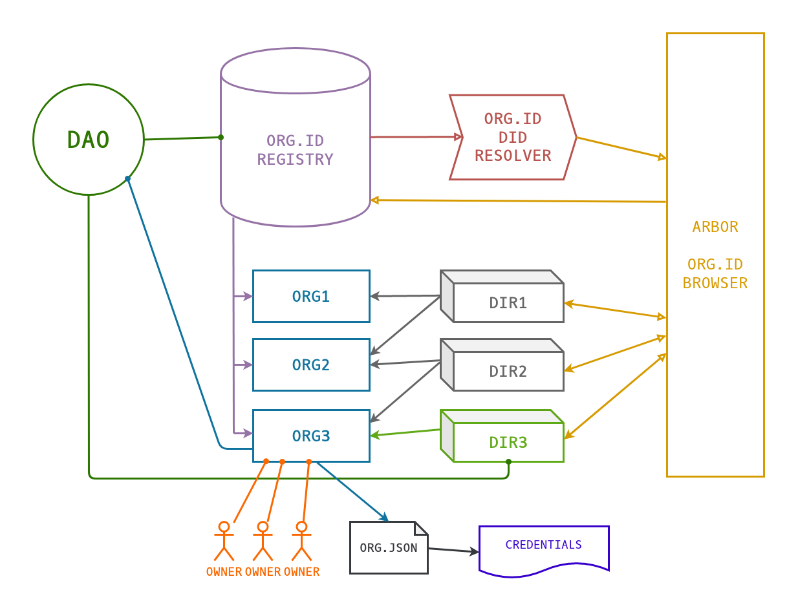

[](https://travis-ci.org/windingtree/org.id)
[](https://coveralls.io/github/windingtree/org.id?branch=master&v=2.0)

<a href="https://orgid.tech"></a>

## ORGiD Registry

ORGiD Registry is the core smart contract of the [ORGiD ecosystem](https://orgid.tech). It is a list of all organizations and their organizational units. Its interface allows to retrieve information about all and any organization or unit, as well as create and change them.

### Mainnet

`0xC1A0A8b02351F7E3e2ebD9B5b6a80fF7cdAF93D1` [full config](./.openzeppelin/main-OrgId.json) v0.12.1

### Ropsten

`0x2cb8dCf26830B969555E04C2EDe3fc1D1BaD504E` [full config](./.openzeppelin/ropsten-OrgId.json) v1.0.1

### ORGiD Sandbox

```sh
docker run --rm -it -p 8545:8545 -p 8546:8546 -p 30303:30303 --name org.id-sandbox windingtree/org.id-sandbox
```

[ORGiD Sandbox docker container](https://hub.docker.com/r/windingtree/org.id-sandbox) is the easiest way to start developing applications for the ORGiD ecosystem.

## Usage

```sh
npm i @windingtree/org.id
```
```javascript
// ABI
const { OrgIdContract, OrgIdInterfaceContract, addresses } = require('@windingtree/org.id');
// Contract addresses
const { mainnet, ropsten } = addresses;
```

## Interface

[Auto-generated docs](./docs/OrgId.md).

## ORGiD Record Structure

Both organization and unit records have:

| **Name** | **Type** | **Description** |
|-|-|-|
| `orgId` | `bytes32` | Unique Organization ID |
| `isActive` | `bool` | Indicates whether ORGiD is active |
| `owner` | `address` | Account (or smart contract) currently authorized to manage ORGiD |
| `orgJsonUri` | `string` | URI of a [ORG.JSON-compliant](https://github.com/windingtree/org.json-schema) datasheet ([example](https://gist.githubusercontent.com/kvakes/0f728d60add6561f18d173c01f87a5bd/raw/9ba3c6fd08c29daaff9809ffa04be09a66196900/glider.json)) |
| `orgJsonHash` | `bytes32` | ORG.JSON keccak256 hash |

Additionally, unit's ORGiD may contain:

| **Name** | **Type** | **Description** |
|-|-|-|
| `parentOrgId` | `bytes32` | Unit parent's ORGiD |
| `director` | `address` | Director may change unit's ORG.JSON and its hash |
| `isDirectorshipAccepted` | `bool` | Director must accept their role explicitly, in which case this flag is set to `true` |

## Development

### Setup

```sh
npm i
npm link
```

### Test

```sh
npm run test
npm run test ./<path_to_test_file>.js
```

### Test coverage

```sh
npm run coverage
```

### Linting

```sh
npm run lint

```

## ORGiD Ecosystem



- [Winding Tree DAO](https://github.com/windingtree/dao) controls ORGiD Registry smart contract and some Directories (including their rules)
- **ORGiD Registry**
- [ORG.JSON Schema](https://github.com/windingtree/org.json-schema) is a data format for describing organizations
- [ORGiD Resolver](https://github.com/windingtree/org.id-resolver) is an utility for fetching information about organization in [W3C DID](https://w3c.github.io/did-core/) format
- [ORGiD Directories](https://github.com/windingtree/org.id-directories) are curated lists of organizations
- [Arbor](https://arbor.fm) can be used to look up an ORGiD, and also to create and manage your own ORGiD
